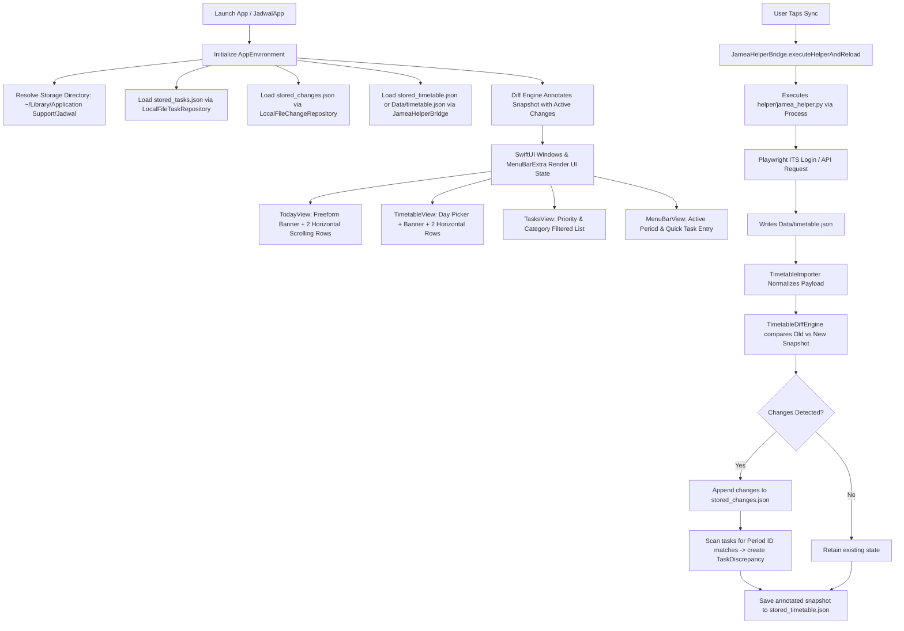

# Current Behavior Baseline: Jadwal Desktop

**Date**: 2026-09-10  
**Project**: Jadwal  
**Scope**: Call graphs, data flow, authentication lifecycle, change detection, and schedule exceptions.

---

## 1. Application Call Graph

---

## 2. Timetable Normalization & Identity

1. **Deterministic Period Occurrence ID**:
   - `id = "{dateString}_{periodName.replacingOccurrences(of: " ", with: "_")}"`
   - Example: `2026-09-07_Period_2` or `2026-09-07_(PT)`.
2. **Break Detection**:
   - Gaps between period `endTime` and next period `startTime` of $\ge 10$ minutes automatically become `ScheduleTimelineItem.breakBlock`.
   - Breaks are dynamically named:
     - Morning prep (before 08:00): `Morning Preparation`
     - Midday (10:00 - 12:00): `Recess`
     - Noon (12:00 - 14:00): `Lunch & Namaz Break`
     - Afternoon: `Afternoon Break`

---

## 3. Day Schedule Rules & Exceptions

### Monday – Thursday (Full Academic Day, 10 Periods)
- **Period 1**: Physical Training (PT) at 06:00 – 07:00.
- **Break**: Morning Preparation (07:00 – 08:50).
- **Periods 2 – 5**: 08:50 – 11:30.
- **Break**: Recess (10:35 – 10:55).
- **Row 1 Boundary**: Periods 1 to 5 + breaks.
- **Periods 6 – 10**: 11:30 – 15:45.
- **Break**: Lunch & Namaz (12:40 – 14:00).
- **Row 2 Boundary**: Periods 6 to 10 + breaks.

### Friday (Jumua Mubarak, 9 Periods)
- **No Morning PT**: Begins at 08:50 with Period 2.
- **Row 1 Boundary**: Periods 2 to 5 + Recess.
- **Extended Jumua Break**: 12:40 – 14:00 (80 minutes).
- **Row 2 Boundary**: Periods 6 to 10.

### Saturday (Half-Day, 8 Periods)
- **Start**: 08:15 with Period 1 (Nahj al-Balaghah).
- **Conclusion**: Ends at 13:15 with Period 8 (Al-Mu'addib). No Periods 9 or 10.
- **Row 1 Boundary**: Periods 1 to 4 + Recess break (10:35 – 10:55).
- **Row 2 Boundary**: Periods 5 to 8. Concludes afternoon.

---

## 4. Task Protection & Discrepancy Invariants

- User tasks are **never deleted** or overwritten when the school timetable changes.
- If a class subject changes (e.g. from *Linguistics* to *Economics*):
  - A `TaskDiscrepancy` is attached to the task with `originalSubject` and `newSubject`.
  - The user can choose to:
    1. **Adopt New Subject**: Updates `linkedSubject = newSubject` and clears discrepancy.
    2. **Keep Original Context**: Retains original subject and marks discrepancy as dismissed.
    3. **Dismiss**: Ignores notice.
- If a period is cancelled or removed, tasks attached to it remain in the user's task list and are marked with a discrepancy indicating the period was removed.

---

## 5. Menu Bar / System Tray Companion Behavior

- Displays the currently active or next upcoming period today.
- Includes a live ticking countdown or time range.
- Quick single-line task input (`TextField` -> `addTask`).
- Shows up to 4 pending tasks with one-click completion toggling.
- Opens main app window or terminates application cleanly.
